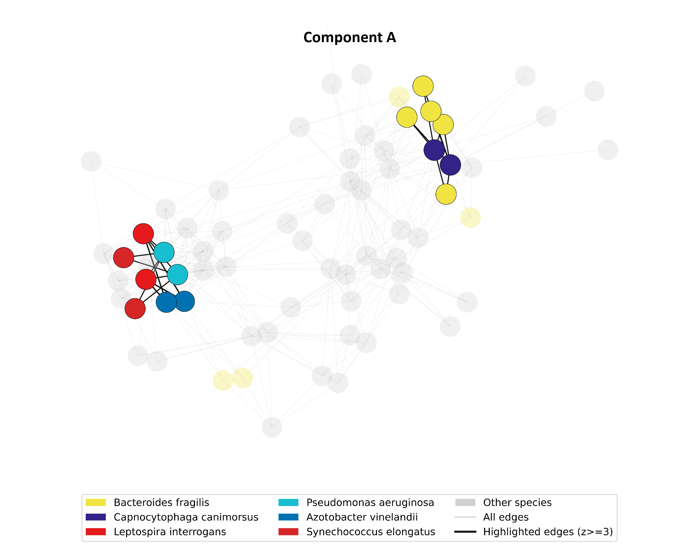
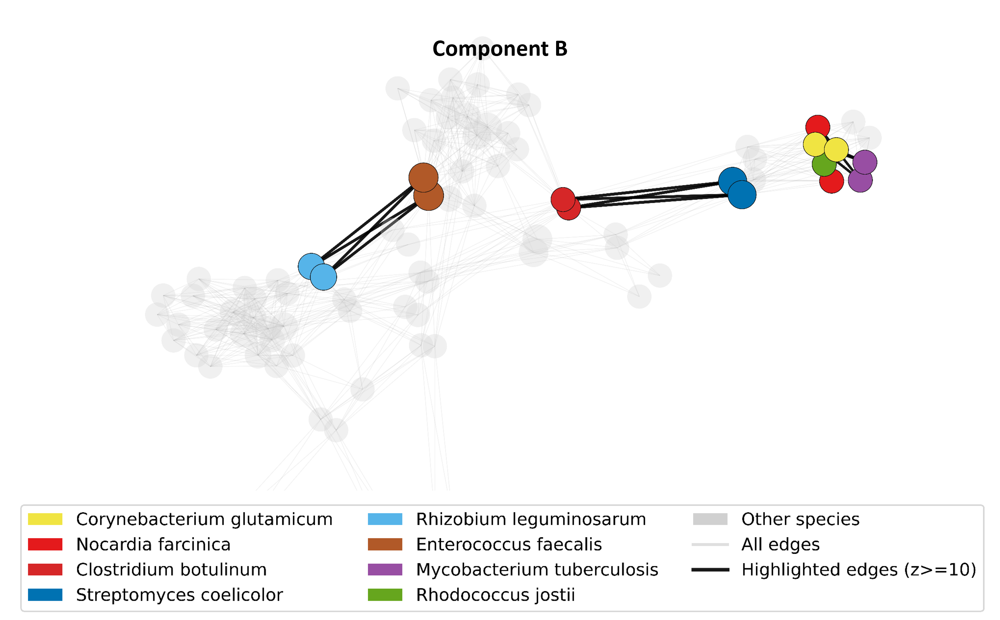
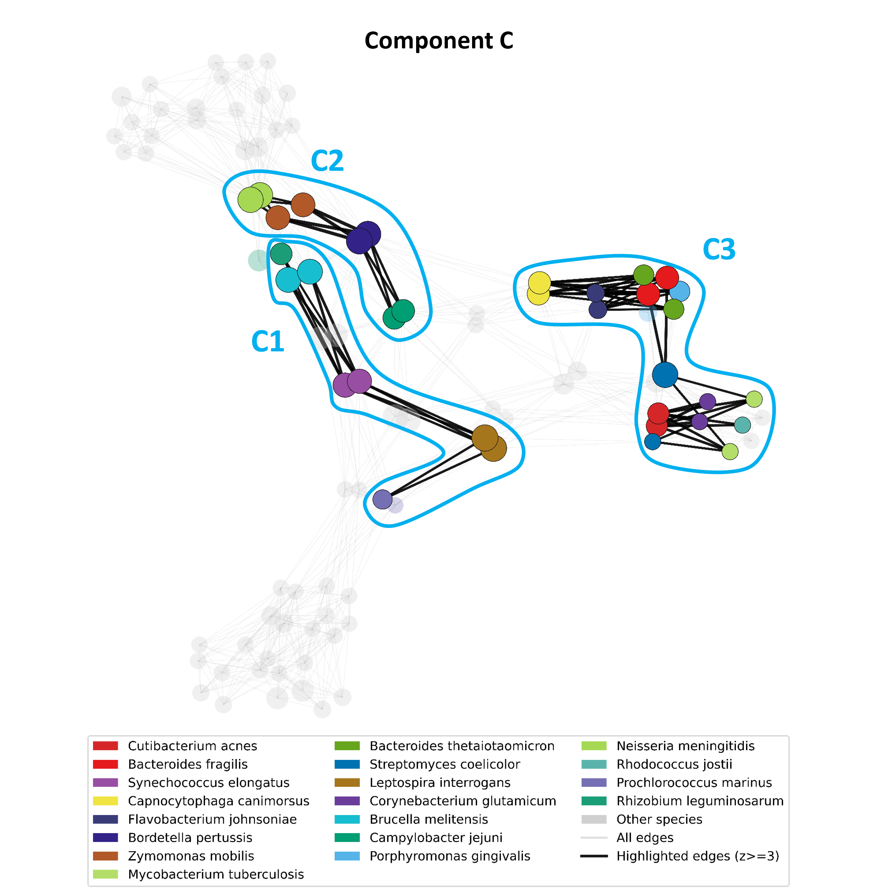

# 🧬 Who Stole My Genes?

**Who Stole My Genes?** is a computational biology project that hunts for *horizontal gene transfer* (HGT) candidates across bacterial genomes – without the computational weight of whole-genome phylogenetics.  
Instead of asking _"Which species are related?"_, we ask:
- Which proteins are suspiciously similar across phylogenetically distant species?
- Can graph topology alone expose genes that crossed species boundaries?

This project was created by [**Or Forshmit**](https://github.com/OrF8), [**Noam Kimhi**](https://github.com/noam-kimhi), [**Roee Tekoah**](https://github.com/roeetekoah), [**Dor Stein**](https://github.com/dorstein0909), and [**Noam Korkos**](https://github.com/NoamKorkos)  
as part of the course [**76558 – Algorithms in Computational Biology**](https://shnaton.huji.ac.il/index.php/NewSyl/76558/1/2026/) at the Hebrew University of Jerusalem ([**HUJI**](https://en.huji.ac.il/)).

Full paper available [here](LaTeX/Who%20Stole%20My%20Genes%20-%20Detecting%20HGT%20Candidates%20Using%20Graph-Based%20Analysis.pdf).

<p align="center">
  
  
  
  
  
</p>

---

## 🔗 Table of Contents

- [📍 Overview](#-overview)
- [✨ Key Features](#-key-features)
- [🔬 Methodology](#-methodology)
  - [Method 1 – Orthologous Clustering](#method-1--orthologous-clustering)
  - [Method 2 – Alignment-Free k-mer Pipeline](#method-2--alignment-free-k-mer-pipeline)
- [📁 Project Structure](#-project-structure)
- [🚀 Getting Started](#-getting-started)
  - [☑️ Prerequisites](#%EF%B8%8F-prerequisites)
  - [⚙️ Installation](#%EF%B8%8F-installation)
  - [🤖 Usage](#-usage)
- [📊 Results](#-results)
- [🛠️ Technologies](#%EF%B8%8F-technologies)
- [👥 Contributors](#-contributors)
- [🎓 Course Context](#-course-context)
- [📄 License](#-license)

---

## 📍 Overview

Horizontal Gene Transfer (HGT) is one of evolution's most disruptive forces – bacteria can acquire entirely new capabilities by directly absorbing genes from unrelated organisms.  
Detecting these events computationally is hard: high similarity across distant species can arise from HGT, but also from convergent evolution, strong functional conservation, or assembly artifacts.

This project explores a **lightweight, graph-based approach** to HGT candidate detection.  
Rather than running computationally expensive whole-genome alignments or phylogenetic reconstructions, we model cross-species protein similarity as a **sparse graph** and leverage its global topology to flag anomalous edges – connections that are too strong given the taxonomic distance between their endpoints.

Two independent methodologies were developed and compared:  
- **Method 1** operates at the *protein level*, grouping proteins into homologous clusters and analyzing each cluster's internal similarity graph.  
- **Method 2** operates at the *proteome level*, using alignment-free *k*-mer Jaccard similarity to build a large cross-species graph and extract statistical outliers.

---

## ✨ Key Features

- **Two complementary HGT detection pipelines** – alignment-based and alignment-free
- **MMSeqs2 clustering** for scalable homolog grouping (Method 1)
- **k-mer inverted index** for fast candidate edge generation without alignment (Method 2)
- **Taxonomic distance integration** via the NCBI Taxonomy database
- **Graph-theoretic scoring** – suspicious edge detection, node HGT scores, betweenness, z-scores
- **3D interactive visualizations** of protein similarity graphs (Plotly)
- **Neighbor-Joining phylogenetic trees** for top HGT candidates (Method 1)
- **Simulation framework** to stress-test pipeline sensitivity against ancient/ameliorated HGTs (Method 2)

---

## 🔬 Methodology

### Method 1 – Orthologous Clustering

This method focuses on individual proteins, clustering them into homologous groups and searching for cross-species anomalies within each group.

```
Protein FASTAs (15 bacterial proteomes)
        │
        ▼
  Step 1: MMSeqs2 Clustering
  (identity ≥ 50%, coverage ≥ 80%)
        │
        ▼
  Step 2: Pairwise Alignment (BLOSUM62, local)
  Edge created if: identity ≥ 0.5 AND coverage ≥ 0.8 AND aligned_len ≥ 50
  SimilarityScore(u,v) = Identity × Coverage
        │
        ▼
  Step 3: NCBI Taxonomy Annotation
  Taxonomic distance d(u,v) = lowest shared rank index
        │
        ▼
  Step 4: HGT Scoring
  Suspicious edge: d_tax ≥ 2 AND SimilarityScore ≥ 0.6
  HGT score(i) = Σ SimilarityScore over suspicious edges
  Candidate: score ≥ P70 AND suspicious_degree ≥ 2
        │
        ▼
  Output: Top HGT candidates + 3D graph + NJ phylogenetic tree
```

### Method 2 – Alignment-Free k-mer Pipeline

This method scales to 48 species (19 taxonomic families) without pairwise alignment, relying instead on *k*-mer composition statistics and graph-level anomaly detection.
This method treats proteins as nodes in a cross-species similarity graph, then scores proteins and components for HGT-like behavior using graph structure and species-pair-normalized edge surprise – no pairwise alignment required.

The pipeline has two parts:
- **`graph_construction`**: builds candidate protein similarity edges from protein FASTAs and prunes them into a graph input.
- **`hgt_pipeline`**: consumes a pruned edge list and produces edge/node/component features plus ranked HGT candidates.

There are two practical entry paths:
- **Shortcut path**: use the preincluded canonical pruned graph `golden/reference_inputs/edges_PRUNED_JACCARD_92790.tsv` and run `python -m hgt_pipeline.pipeline`.
- **Full E2E path**: start from `data/assembly_summary_refseq.txt` + `config/species.txt`, build manifest/downloads/candidates/pruned edges, then run `python -m hgt_pipeline.pipeline`.

```
Protein FASTAs (48 species, 19 families from RefSeq)
        │
        ▼
  Step 1: k-mer Extraction
  Build inverted index; compute shared k-mer count & Jaccard per candidate pair
        │
        ▼
  Step 2: Candidate Edge Generation
  Filter by minimum shared k-mers and top-M per protein
        │
        ▼
  Step 3: Graph Pruning
  Percentile Jaccard threshold + top-X edges per node
        │
        ▼
  Step 4: Graph Construction & Connected Components
        │
        ▼
  Step 5: Per-species-pair Robust Statistics
  Compute z-scores for each edge relative to its species-pair background
        │
        ▼
  Step 6: Node & Component Feature Extraction
  Betweenness centrality, clustering coefficient, component concentration
        │
        ▼
  Step 7: HGT Candidate Ranking
  Composite HGT-likeness score → ranked candidate list
        │
        ▼
  Output: hgt_candidates.tsv, all_scores.tsv, edge/node/component features
```

---

## 📁 Project Structure

The repository is organised around two independent detection pipelines, each in its own top-level directory.

```
Who-Stole-My-Genes/
├── Method 1/                        # Alignment-based pipeline
│   ├── create_graph.py              # Entry point – run the full Method 1 pipeline
│   ├── hgt_graph/                   # Core library
│   │   ├── cli.py                   # Argument parsing & orchestration
│   │   ├── constants.py             # Thresholds, paths, shared constants
│   │   ├── graph/                   # Graph construction & HGT scoring
│   │   ├── io/                      # Protein FASTA I/O utilities
│   │   ├── similarity/              # Pairwise alignment logic (BLOSUM62)
│   │   ├── taxonomy/                # NCBI taxonomy integration & caching
│   │   └── viz/                     # Plotly 3D graph & phylogenetic tree export
│   ├── MMSeqs2 Files/               # MMSeqs2 clustering scripts and outputs
│   ├── data/                        # Sample cluster CSVs and taxonomy cache
│   └── results/                     # Generated HTML graphs & phylogenetic trees
│
├── Method 2/                        # Alignment-free k-mer pipeline
│   ├── pyproject.toml               # Editable install for Method 2 package (`python -m pip install -e .`)
│   ├── simulations/
│   │   ├── simulation.py            # Signal-strength sweep simulation
│   │   └── ancient_hgt_simulation.py# Ancient/ameliorated stress-test simulation
│   ├── tax_distances.txt            # Precomputed taxonomic distances
│   ├── config/
│   │   └── species.txt              # Target bacterial species list
│   ├── src/
│   │   ├── graph_construction/
│   │   │   ├── orchestrator.py          # Build/prune orchestration CLI
│   │   │   ├── refseq_fetch_proteins.py # Manifest + RefSeq FASTA retrieval
│   │   │   ├── kmer_candidates_from_faa.py
│   │   │   ├── k_mer_encoding.py
│   │   │   ├── fasta_parsing.py
│   │   │   └── graph_pruning.py         # Integrated pruning logic
│   │   └── hgt_pipeline/
│   │       ├── pipeline.py              # Main Method 2 pipeline entrypoint
│   │       └── stages/                  # edge_io, pair_stats, graph_ops, node_features, component_features, ranking
│   ├── tests/                       # Regression checks for golden outputs
│   ├── tools/
│   │   ├── REPRODUCE.md             # Reproducibility instructions for Method 2 experiments
│   │   ├── reporting/               # Post-run reporting and visualisation scripts
│   │   └── reproduce.py             # Convenience runner for reproducing results
│   ├── data/                        # RefSeq downloads (assembly summary tracked via Git LFS)
│   └── golden/                      # Canonical reference outputs and small test inputs
│       ├── bw_pipeline/             # Canonical pipeline outputs (with betweenness)
│       ├── no_bw_pipeline/          # Alternate pipeline outputs (without betweenness)
│       ├── reference_inputs/        # Prebuilt edge/manifest files for quickstart runs
│       └── hackathon_report_refs/   # Figures and tables used in the project report
│
├── LaTeX/                           # Academic paper (PDF + LaTeX source + figures)
└── requirements.txt                 # Python dependencies
```

- **`Method 1/`** – Takes MMSeqs2 protein clusters, performs pairwise alignment, annotates with NCBI taxonomy, scores edges for HGT likelihood, and renders interactive 3D graphs plus Neighbor-Joining trees.
- **`Method 2/`** – Builds a cross-species protein similarity graph from k-mer Jaccard scores (no alignment), prunes edges statistically, then extracts edge/node/component features to rank HGT candidates.
- **`LaTeX/`** – Full project paper; a prebuilt PDF is included for quick reference.
- **`requirements.txt`** – All Python dependencies; install with `pip install -r requirements.txt`.

---

## 🚀 Getting Started

### ☑️ Prerequisites

- Python ≥ 3.10
- pip
- [MMSeqs2](https://github.com/soedinglab/MMseqs2) (required for Method 1 clustering step)

### ⚙️ Installation

1. Clone the repository:
```sh
git clone https://github.com/noam-kimhi/Who-Stole-My-Genes
```

2. Navigate to the project directory:
```sh
cd Who-Stole-My-Genes
```

3. Install Python dependencies:
```sh
pip install -r requirements.txt
```

### 🤖 Usage

#### Method 1 – Alignment-Based Pipeline

Run the full pipeline on a cluster CSV file:
```sh
cd "Method 1"
python create_graph.py \
    --data data/cluster_999_size12.csv \
    --taxonomy_cache data/taxonomy_data/taxonomy_cache_cluster_999_size12.json \
    --score_percentile 70.0
```

This produces an interactive 3D Plotly graph (`results/`) and a Neighbor-Joining phylogenetic tree for the top HGT candidate.

#### Method 2 – Alignment-Free Pipeline

There are two practical entry paths:
- **Minimal-input path**: start from `data/assembly_summary_refseq.txt` + `config/species.txt`, build manifest/downloads/candidates/pruned edges, then run the pipeline.
- **Shortcut path**: use the preincluded canonical pruned graph `golden/reference_inputs/edges_PRUNED_JACCARD_92790.tsv` and run `python -m hgt_pipeline.pipeline` directly.

Work from the `Method 2` directory:
```sh
cd "Method 2"
python -m pip install -e .
```

##### Quickstart – Canonical Pruned Edges

With betweenness centrality:
```sh
python -m hgt_pipeline.pipeline \
    --in_edges golden/reference_inputs/edges_PRUNED_JACCARD_92790.tsv \
    --out_dir tmp_run_bw
```

Without betweenness (faster):
```sh
python -m hgt_pipeline.pipeline \
    --in_edges golden/reference_inputs/edges_PRUNED_JACCARD_92790.tsv \
    --out_dir tmp_run_no_bw \
    --no_betweenness
```

For automated reporting after the pipeline run, see `Method 2/tools/REPRODUCE.md` and `Method 2/tools/reproduce.py`.

##### Full E2E Recipe (From Scratch)

**Step 1 – Prepare `assembly_summary_refseq.txt`** (tracked via Git LFS – ~216 MB; the repo contains only an LFS pointer, so even if the file appears present you must fetch the actual object or download it manually):
```sh
# Option A: fetch the LFS object (requires git-lfs installed and LFS access)
git lfs pull --include="Method 2/data/assembly_summary_refseq.txt"

# Option B: download directly from NCBI
curl -L -o data/assembly_summary_refseq.txt \
    https://ftp.ncbi.nlm.nih.gov/genomes/ASSEMBLY_REPORTS/assembly_summary_refseq.txt
```

**Step 2 – Build manifest + download FASTAs** from `config/species.txt`:
```sh
python -m graph_construction.refseq_fetch_proteins \
    --assembly_summary data/assembly_summary_refseq.txt \
    --species_list config/species.txt \
    --out_dir tmp/e2e/graph_construction \
    --max_assemblies_per_species 2 \
    --require_latest \
    --download
```

**Step 3 – Construct candidates and pruned edges:**
```sh
python -m graph_construction.orchestrator construct-edges \
    --manifest tmp/e2e/graph_construction/manifest.tsv \
    --downloads_dir data/out_refseq/downloads \
    --out_candidates tmp/e2e/candidates.tsv \
    --out_edges tmp/e2e/edges_pruned.tsv \
    --k 6 --min_len 50 --max_postings 100 --min_shared 6 --top_m 10 --q 0.9 --top_x 20
```

**Step 4 – Run the HGT pipeline:**
```sh
python -m hgt_pipeline.pipeline \
    --in_edges tmp/e2e/edges_pruned.tsv \
    --out_dir tmp/e2e/pipeline_bw
```

**Step 5 – Generate reports:**
```sh
python tools/reporting/top_anomaly_edges.py \
    --edges tmp/e2e/pipeline_bw/edge_features.tsv \
    --top_n 25 \
    --out_dir tmp/e2e/pipeline_bw/results

python tools/reporting/summarize_global_stats.py \
    --component_features tmp/e2e/pipeline_bw/component_features.tsv \
    --protein_features tmp/e2e/pipeline_bw/protein_features.tsv \
    --edge_features tmp/e2e/pipeline_bw/edge_features.tsv \
    --hgt_candidates tmp/e2e/pipeline_bw/hgt_candidates.tsv \
    --out_prefix tmp/e2e/pipeline_bw/results/global_stats
```

Output files in `results/`:  
| File | Description |
|---|---|
| `hgt_candidates.tsv` | Top-200 ranked HGT candidate proteins |
| `all_scores.tsv` | HGT-likeness scores for all proteins |
| `edge_features.tsv` | Per-edge z-scores and Jaccard statistics |
| `protein_features.tsv` | Per-node betweenness, clustering, component features |
| `component_features.tsv` | Per-component concentration and z-score statistics |

<details>
<summary>Optional: Explanations and Artifact Reproduction</summary>

**Explanations (top components and top candidates):**
```sh
python tools/reporting/explain_component.py --component_id 5 --edges tmp/e2e/pipeline_bw/edge_features.tsv --protein_features tmp/e2e/pipeline_bw/protein_features.tsv --component_features tmp/e2e/pipeline_bw/component_features.tsv --hgt_candidates tmp/e2e/pipeline_bw/hgt_candidates.tsv --top_nodes 20 --top_edges 25
python tools/reporting/explain_component.py --component_id 8 --edges tmp/e2e/pipeline_bw/edge_features.tsv --protein_features tmp/e2e/pipeline_bw/protein_features.tsv --component_features tmp/e2e/pipeline_bw/component_features.tsv --hgt_candidates tmp/e2e/pipeline_bw/hgt_candidates.tsv --top_nodes 20 --top_edges 25
python tools/reporting/explain_component.py --component_id 32 --edges tmp/e2e/pipeline_bw/edge_features.tsv --protein_features tmp/e2e/pipeline_bw/protein_features.tsv --component_features tmp/e2e/pipeline_bw/component_features.tsv --hgt_candidates tmp/e2e/pipeline_bw/hgt_candidates.tsv --top_nodes 20 --top_edges 25
python tools/reporting/explain_top_candidates.py --edges tmp/e2e/pipeline_bw/edge_features.tsv --protein_features tmp/e2e/pipeline_bw/protein_features.tsv --component_features tmp/e2e/pipeline_bw/component_features.tsv --hgt_candidates tmp/e2e/pipeline_bw/hgt_candidates.tsv --top_n 20 --top_k_neighbors 12
```

**Artifacts reproduction (component plots 5, 8, 32):**
```sh
python tools/reporting/plot_components.py \
    --edges golden/bw_pipeline/rerun_pruned/edge_features.tsv \
    --protein_features golden/bw_pipeline/rerun_pruned/protein_features.tsv \
    --hgt_candidates golden/bw_pipeline/rerun_pruned/hgt_candidates.tsv \
    --component_ids 5,8,32 \
    --z_min_highlight 3 \
    --node_size_mode score \
    --out_dir artifacts/updated_plots/detailed
```

</details>

---

## 📊 Results

Both methods were applied to diverse bacterial datasets spanning gram-positive, gram-negative, and extremophilic organisms.

**Method 1** successfully flagged known HGT-associated genes (e.g., *eptC*, *ymdF*) and produced phylogenetic trees that visually confirm their anomalous cross-species similarity:

| EptC – Similarity Graph                     | EptC – Phylogenetic Tree |
|---------------------------------------------|---|
|  |  |

**Method 2** demonstrated strong statistical signal in high-*z* edges and identified clusters with elevated species-pair boundary crossings. Component-level analysis revealed concentrated HGT-like components distinguishable from background noise:

| Component A                             | Component B                             | Component C                             |
|-----------------------------------------|-----------------------------------------|-----------------------------------------|
|  |  |  |

The simulation in `Method 2/simulations/ancient_hgt_simulation.py` further characterizes Method 2's sensitivity to ancient, ameliorated HGT signals versus conserved hub proteins.

---

## 🛠️ Technologies

<p align="center">
  
  
  
  
  
  
  
  
  
  
  
</p>

| Tool / Library | Role |
|---|---|
| **MMSeqs2** | Ultra-fast protein sequence clustering (Method 1) |
| **BioPython** | Pairwise alignment (BLOSUM62), NCBI Entrez taxonomy queries |
| **NetworkX** | Graph construction, connected components, betweenness centrality |
| **Plotly** | Interactive 3D protein similarity graph visualization |
| **Matplotlib** | Phylogenetic tree rendering, diagnostic plots |
| **scikit-learn** | ROC-AUC evaluation in simulation benchmarks |
| **NumPy / Pandas** | Numerical computation and tabular data handling |
| **NCBI RefSeq** | Source of bacterial proteome FASTA files |
| **NCBI Taxonomy** | Taxonomic lineage annotation and distance computation |

---

## 👥 Contributors

<table>
  <tr>
    <td align="center">
      <a href="https://github.com/OrF8"><b>Or Forshmit</b></a>
    </td>
    <td align="center">
      <a href="https://github.com/noam-kimhi"><b>Noam Kimhi</b></a>
    </td>
    <td align="center">
      <a href="https://github.com/roeetekoah"><b>Roee Tekoah</b></a>
    </td>
    <td align="center">
      <a href="https://github.com/dorstein0909"><b>Dor Stein</b></a>
    </td>
    <td align="center">
      <a href="https://github.com/NoamKorkos"><b>Noam Korkos</b></a>
    </td>
  </tr>
</table>

<details closed>
<summary>Contributor Graph</summary>
<br>
<p align="left">
  <a href="https://github.com/noam-kimhi/Who-Stole-My-Genes/graphs/contributors">
    
  </a>
</p>
</details>

---

## 🎓 Course Context

This project was developed as part of the **Hackathon** component of:

> **76558 – Algorithms in Computational Biology**  
> [Hebrew University of Jerusalem (HUJI)](https://en.huji.ac.il/)  
> [Course Syllabus](https://shnaton.huji.ac.il/index.php/NewSyl/76558/1/2026/)

### ⚠️ Contribution Policy

This is an **academic course project**, not a community-driven open-source project.  
We are **not seeking pull requests or code contributions**.  
However, we welcome:
- Feedback on our analysis and methods
- Questions or discussion about the graph-based HGT detection approach
- Suggestions for further biological validation

---

## 📄 License

This project is licensed under the GNU General Public License v3.0.

Copyright (c) 2026 Or Forshmit, Noam Kimhi, Roee Tekoah, Dor Stein, Noam Korkos.

See the [LICENSE](LICENSE) file for details.
